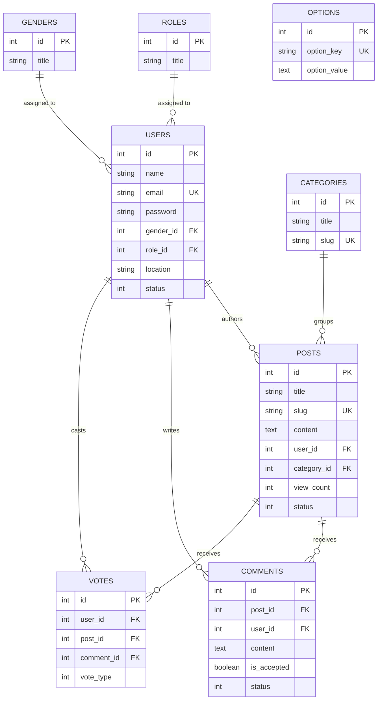

# KiKeno — Database Schema & Architecture Planning

> **Database Engine**: MySQL 8.0+ / MariaDB / PostgreSQL  
> **Default Character Set**: `utf8mb4_unicode_ci` (Full Unicode support for multilingual content)

---

## 📌 Table of Contents
- [1. Entity-Relationship (ER) Diagram](#1-entity-relationship-er-diagram)
- [2. Detailed Table Schemas](#2-detailed-table-schemas)
  - [roles](#1-roles)
  - [genders](#2-genders)
  - [users](#3-users)
  - [categories](#4-categories)
  - [posts](#5-posts)
  - [comments](#6-comments)
  - [votes](#7-votes)
  - [learning_guides](#8-learning_guides)
  - [options](#9-options)
- [3. Indexing & Optimization Strategy](#3-indexing--optimization-strategy)
- [4. Complete SQL DDL Migration Script](#4-complete-sql-ddl-migration-script)

---

## 📊 1. Entity-Relationship (ER) Diagram



---

## 🗄️ 2. Detailed Table Schemas

### 1. `roles`
Stores access permissions and hierarchy levels for system users.

| Column Name | Data Type | Constraints | Description |
|---|---|---|---|
| `id` | `INT(11)` | `PRIMARY KEY, AUTO_INCREMENT` | Unique role identifier |
| `title` | `VARCHAR(50)` | `NOT NULL` | Role title (e.g., Admin, User, Moderator, Expert) |
| `status` | `TINYINT(2)` | `DEFAULT 1` | Role status (1 = Active, 0 = Inactive) |
| `created_at` | `TIMESTAMP` | `NULLABLE` | Creation timestamp |
| `updated_at` | `TIMESTAMP` | `NULLABLE` | Last update timestamp |

---

### 2. `genders`
Lookup table for user profile gender options.

| Column Name | Data Type | Constraints | Description |
|---|---|---|---|
| `id` | `INT(11)` | `PRIMARY KEY, AUTO_INCREMENT` | Identifier |
| `title` | `VARCHAR(15)` | `NOT NULL` | Gender title (e.g., Male, Female, Other) |
| `status` | `TINYINT(2)` | `DEFAULT 1` | Status (1 = Active) |
| `created_at` | `TIMESTAMP` | `NULLABLE` | Creation timestamp |
| `updated_at` | `TIMESTAMP` | `NULLABLE` | Last update timestamp |

---

### 3. `users`
Stores registered user accounts, credentials, profile details, and role relations.

| Column Name | Data Type | Constraints | Description |
|---|---|---|---|
| `id` | `INT(11)` | `PRIMARY KEY, AUTO_INCREMENT` | Unique user ID |
| `name` | `VARCHAR(150)` | `NOT NULL` | User full name |
| `email` | `VARCHAR(150)` | `NOT NULL, UNIQUE` | User email address (login credential) |
| `password` | `VARCHAR(255)` | `NOT NULL` | Hashed password string |
| `gender_id` | `INT(11)` | `NULLABLE, FK -> genders.id` | Foreign key to gender table |
| `role_id` | `INT(11)` | `NOT NULL, DEFAULT 1, FK -> roles.id` | Foreign key to roles table |
| `country` | `VARCHAR(100)` | `NULLABLE` | Country of residence |
| `location` | `VARCHAR(255)` | `NULLABLE` | City / address details |
| `status` | `TINYINT(2)` | `DEFAULT 1` | Account status (1 = Active, 0 = Blocked) |
| `created_at` | `TIMESTAMP` | `NULLABLE` | Account registration time |
| `updated_at` | `TIMESTAMP` | `NULLABLE` | Profile modification time |
| `deleted_at` | `TIMESTAMP` | `NULLABLE` | Soft delete timestamp |

---

### 4. `categories`
Taxonomy categories for grouping forum questions and articles.

| Column Name | Data Type | Constraints | Description |
|---|---|---|---|
| `id` | `INT(11)` | `PRIMARY KEY, AUTO_INCREMENT` | Category ID |
| `title` | `VARCHAR(100)` | `NOT NULL` | Category name (e.g., Tech, Health, Finance) |
| `slug` | `VARCHAR(120)` | `NOT NULL, UNIQUE` | URL-friendly slug |
| `status` | `TINYINT(2)` | `DEFAULT 1` | Category status |
| `created_at` | `TIMESTAMP` | `NULLABLE` | Creation timestamp |
| `updated_at` | `TIMESTAMP` | `NULLABLE` | Last update timestamp |

---

### 5. `posts`
Stores questions, discussion threads, and knowledge base articles.

| Column Name | Data Type | Constraints | Description |
|---|---|---|---|
| `id` | `INT(11)` | `PRIMARY KEY, AUTO_INCREMENT` | Unique post identifier |
| `title` | `VARCHAR(255)` | `NOT NULL` | Question title |
| `slug` | `VARCHAR(255)` | `NOT NULL, UNIQUE` | Unique URL post slug |
| `content` | `LONGTEXT` | `NULLABLE` | Main content / question body |
| `user_id` | `INT(11)` | `NOT NULL, FK -> users.id` | Author user ID |
| `category_id` | `INT(11)` | `NOT NULL, FK -> categories.id` | Category ID |
| `view_count` | `INT(11)` | `DEFAULT 0` | Total view count |
| `vote_score` | `INT(11)` | `DEFAULT 0` | Aggregate vote score |
| `status` | `TINYINT(2)` | `DEFAULT 1` | Post status (1 = Published, 0 = Draft/Hidden) |
| `created_at` | `TIMESTAMP` | `NULLABLE` | Creation timestamp |
| `updated_at` | `TIMESTAMP` | `NULLABLE` | Last update timestamp |
| `deleted_at` | `TIMESTAMP` | `NULLABLE` | Soft delete timestamp |

---

### 6. `comments`
Stores community answers and nested discussion replies.

| Column Name | Data Type | Constraints | Description |
|---|---|---|---|
| `id` | `INT(11)` | `PRIMARY KEY, AUTO_INCREMENT` | Comment identifier |
| `post_id` | `INT(11)` | `NOT NULL, FK -> posts.id` | Parent post ID |
| `user_id` | `INT(11)` | `NOT NULL, FK -> users.id` | Author user ID |
| `parent_id` | `INT(11)` | `NULLABLE, FK -> comments.id` | Parent comment ID for nested threads |
| `content` | `TEXT` | `NOT NULL` | Answer / comment text |
| `is_accepted` | `TINYINT(1)` | `DEFAULT 0` | Accepted answer status (1 = Accepted) |
| `status` | `TINYINT(2)` | `DEFAULT 1` | Status |
| `created_at` | `TIMESTAMP` | `NULLABLE` | Creation timestamp |
| `updated_at` | `TIMESTAMP` | `NULLABLE` | Last update timestamp |
| `deleted_at` | `TIMESTAMP` | `NULLABLE` | Soft delete timestamp |

---

### 7. `votes`
Tracks upvotes and downvotes on posts and comments.

| Column Name | Data Type | Constraints | Description |
|---|---|---|---|
| `id` | `INT(11)` | `PRIMARY KEY, AUTO_INCREMENT` | Vote record ID |
| `user_id` | `INT(11)` | `NOT NULL, FK -> users.id` | User casting the vote |
| `post_id` | `INT(11)` | `NULLABLE, FK -> posts.id` | Target post ID (if applicable) |
| `comment_id` | `INT(11)` | `NULLABLE, FK -> comments.id` | Target comment ID (if applicable) |
| `vote_type` | `TINYINT(2)` | `NOT NULL` | 1 = Upvote, 2 = Downvote |
| `created_at` | `TIMESTAMP` | `NULLABLE` | Timestamp when vote was cast |
| `updated_at` | `TIMESTAMP` | `NULLABLE` | Last update timestamp |

> *Unique Constraints*: Unique composite keys `(user_id, post_id)` and `(user_id, comment_id)` prevent duplicate votes per user.

---

### 8. `learning_guides`
Stores learning pathways, roadmaps, and cheatsheet metadata.

| Column Name | Data Type | Constraints | Description |
|---|---|---|---|
| `id` | `INT(11)` | `PRIMARY KEY, AUTO_INCREMENT` | Identifier |
| `title` | `VARCHAR(200)` | `NOT NULL` | Guide title (e.g., Laravel Fundamentals) |
| `slug` | `VARCHAR(220)` | `NOT NULL, UNIQUE` | URL slug |
| `guide_type` | `VARCHAR(50)` | `NOT NULL` | `FREE_GUIDE`, `ROADMAP`, `CHEATSHEET` |
| `description` | `TEXT` | `NULLABLE` | Overview description |
| `status` | `TINYINT(2)` | `DEFAULT 1` | Status |
| `created_at` | `TIMESTAMP` | `NULLABLE` | Creation timestamp |
| `updated_at` | `TIMESTAMP` | `NULLABLE` | Last update timestamp |

---

### 9. `options`
Stores global platform configuration settings as key-value pairs.

| Column Name | Data Type | Constraints | Description |
|---|---|---|---|
| `id` | `INT(11)` | `PRIMARY KEY, AUTO_INCREMENT` | Identifier |
| `option_key` | `VARCHAR(100)` | `NOT NULL, UNIQUE` | Config key (e.g., site_name, tagline, logo) |
| `option_value` | `LONGTEXT` | `NULLABLE` | Config value |
| `created_at` | `TIMESTAMP` | `NULLABLE` | Creation timestamp |
| `updated_at` | `TIMESTAMP` | `NULLABLE` | Last update timestamp |

---

## ⚡ 3. Indexing & Optimization Strategy

1. **Full-Text Search Index**:
   - `FULLTEXT KEY ft_posts_search (title, content)` for high-speed keyword search.
2. **Foreign Key Indexes**:
   - `posts(user_id)`, `posts(category_id)`
   - `comments(post_id)`, `comments(user_id)`
   - `votes(user_id, post_id)`
3. **Soft Delete Filters**:
   - Index on `deleted_at` across `users`, `posts`, and `comments` tables.

---

## 📜 4. Complete SQL DDL Migration Script

```sql
-- Database creation
CREATE DATABASE IF NOT EXISTS `kikeno_db` DEFAULT CHARACTER SET utf8mb4 COLLATE utf8mb4_unicode_ci;
USE `kikeno_db`;

-- Roles Table
CREATE TABLE `roles` (
  `id` INT(11) NOT NULL AUTO_INCREMENT,
  `title` VARCHAR(50) NOT NULL,
  `status` TINYINT(2) NOT NULL DEFAULT 1,
  `created_at` TIMESTAMP NULL DEFAULT CURRENT_TIMESTAMP,
  `updated_at` TIMESTAMP NULL DEFAULT CURRENT_TIMESTAMP ON UPDATE CURRENT_TIMESTAMP,
  PRIMARY KEY (`id`)
) ENGINE=InnoDB DEFAULT CHARSET=utf8mb4;

-- Genders Table
CREATE TABLE `genders` (
  `id` INT(11) NOT NULL AUTO_INCREMENT,
  `title` VARCHAR(15) NOT NULL,
  `status` TINYINT(2) NOT NULL DEFAULT 1,
  `created_at` TIMESTAMP NULL DEFAULT CURRENT_TIMESTAMP,
  `updated_at` TIMESTAMP NULL DEFAULT CURRENT_TIMESTAMP ON UPDATE CURRENT_TIMESTAMP,
  PRIMARY KEY (`id`)
) ENGINE=InnoDB DEFAULT CHARSET=utf8mb4;

-- Users Table
CREATE TABLE `users` (
  `id` INT(11) NOT NULL AUTO_INCREMENT,
  `name` VARCHAR(150) NOT NULL,
  `email` VARCHAR(150) NOT NULL UNIQUE,
  `password` VARCHAR(255) NOT NULL,
  `gender_id` INT(11) DEFAULT NULL,
  `role_id` INT(11) NOT NULL DEFAULT 1,
  `country` VARCHAR(100) DEFAULT NULL,
  `location` VARCHAR(255) DEFAULT NULL,
  `status` TINYINT(2) NOT NULL DEFAULT 1,
  `created_at` TIMESTAMP NULL DEFAULT CURRENT_TIMESTAMP,
  `updated_at` TIMESTAMP NULL DEFAULT CURRENT_TIMESTAMP ON UPDATE CURRENT_TIMESTAMP,
  `deleted_at` TIMESTAMP NULL DEFAULT NULL,
  PRIMARY KEY (`id`),
  CONSTRAINT `fk_users_gender` FOREIGN KEY (`gender_id`) REFERENCES `genders` (`id`) ON DELETE SET NULL,
  CONSTRAINT `fk_users_role` FOREIGN KEY (`role_id`) REFERENCES `roles` (`id`) ON DELETE CASCADE
) ENGINE=InnoDB DEFAULT CHARSET=utf8mb4;

-- Categories Table
CREATE TABLE `categories` (
  `id` INT(11) NOT NULL AUTO_INCREMENT,
  `title` VARCHAR(100) NOT NULL,
  `slug` VARCHAR(120) NOT NULL UNIQUE,
  `status` TINYINT(2) NOT NULL DEFAULT 1,
  `created_at` TIMESTAMP NULL DEFAULT CURRENT_TIMESTAMP,
  `updated_at` TIMESTAMP NULL DEFAULT CURRENT_TIMESTAMP ON UPDATE CURRENT_TIMESTAMP,
  PRIMARY KEY (`id`)
) ENGINE=InnoDB DEFAULT CHARSET=utf8mb4;

-- Posts Table
CREATE TABLE `posts` (
  `id` INT(11) NOT NULL AUTO_INCREMENT,
  `title` VARCHAR(255) NOT NULL,
  `slug` VARCHAR(255) NOT NULL UNIQUE,
  `content` LONGTEXT DEFAULT NULL,
  `user_id` INT(11) NOT NULL,
  `category_id` INT(11) NOT NULL,
  `view_count` INT(11) NOT NULL DEFAULT 0,
  `vote_score` INT(11) NOT NULL DEFAULT 0,
  `status` TINYINT(2) NOT NULL DEFAULT 1,
  `created_at` TIMESTAMP NULL DEFAULT CURRENT_TIMESTAMP,
  `updated_at` TIMESTAMP NULL DEFAULT CURRENT_TIMESTAMP ON UPDATE CURRENT_TIMESTAMP,
  `deleted_at` TIMESTAMP NULL DEFAULT NULL,
  PRIMARY KEY (`id`),
  CONSTRAINT `fk_posts_user` FOREIGN KEY (`user_id`) REFERENCES `users` (`id`) ON DELETE CASCADE,
  CONSTRAINT `fk_posts_category` FOREIGN KEY (`category_id`) REFERENCES `categories` (`id`) ON DELETE CASCADE,
  FULLTEXT KEY `ft_posts_search` (`title`, `content`)
) ENGINE=InnoDB DEFAULT CHARSET=utf8mb4;

-- Comments Table
CREATE TABLE `comments` (
  `id` INT(11) NOT NULL AUTO_INCREMENT,
  `post_id` INT(11) NOT NULL,
  `user_id` INT(11) NOT NULL,
  `parent_id` INT(11) DEFAULT NULL,
  `content` TEXT NOT NULL,
  `is_accepted` TINYINT(1) NOT NULL DEFAULT 0,
  `status` TINYINT(2) NOT NULL DEFAULT 1,
  `created_at` TIMESTAMP NULL DEFAULT CURRENT_TIMESTAMP,
  `updated_at` TIMESTAMP NULL DEFAULT CURRENT_TIMESTAMP ON UPDATE CURRENT_TIMESTAMP,
  `deleted_at` TIMESTAMP NULL DEFAULT NULL,
  PRIMARY KEY (`id`),
  CONSTRAINT `fk_comments_post` FOREIGN KEY (`post_id`) REFERENCES `posts` (`id`) ON DELETE CASCADE,
  CONSTRAINT `fk_comments_user` FOREIGN KEY (`user_id`) REFERENCES `users` (`id`) ON DELETE CASCADE,
  CONSTRAINT `fk_comments_parent` FOREIGN KEY (`parent_id`) REFERENCES `comments` (`id`) ON DELETE CASCADE
) ENGINE=InnoDB DEFAULT CHARSET=utf8mb4;

-- Votes Table
CREATE TABLE `votes` (
  `id` INT(11) NOT NULL AUTO_INCREMENT,
  `user_id` INT(11) NOT NULL,
  `post_id` INT(11) DEFAULT NULL,
  `comment_id` INT(11) DEFAULT NULL,
  `vote_type` TINYINT(2) NOT NULL COMMENT '1=Upvote, 2=Downvote',
  `created_at` TIMESTAMP NULL DEFAULT CURRENT_TIMESTAMP,
  `updated_at` TIMESTAMP NULL DEFAULT CURRENT_TIMESTAMP ON UPDATE CURRENT_TIMESTAMP,
  PRIMARY KEY (`id`),
  UNIQUE KEY `unique_user_post_vote` (`user_id`, `post_id`),
  UNIQUE KEY `unique_user_comment_vote` (`user_id`, `comment_id`),
  CONSTRAINT `fk_votes_user` FOREIGN KEY (`user_id`) REFERENCES `users` (`id`) ON DELETE CASCADE,
  CONSTRAINT `fk_votes_post` FOREIGN KEY (`post_id`) REFERENCES `posts` (`id`) ON DELETE CASCADE,
  CONSTRAINT `fk_votes_comment` FOREIGN KEY (`comment_id`) REFERENCES `comments` (`id`) ON DELETE CASCADE
) ENGINE=InnoDB DEFAULT CHARSET=utf8mb4;

-- Learning Guides Table
CREATE TABLE `learning_guides` (
  `id` INT(11) NOT NULL AUTO_INCREMENT,
  `title` VARCHAR(200) NOT NULL,
  `slug` VARCHAR(220) NOT NULL UNIQUE,
  `guide_type` VARCHAR(50) NOT NULL DEFAULT 'FREE_GUIDE',
  `description` TEXT DEFAULT NULL,
  `status` TINYINT(2) NOT NULL DEFAULT 1,
  `created_at` TIMESTAMP NULL DEFAULT CURRENT_TIMESTAMP,
  `updated_at` TIMESTAMP NULL DEFAULT CURRENT_TIMESTAMP ON UPDATE CURRENT_TIMESTAMP,
  PRIMARY KEY (`id`)
) ENGINE=InnoDB DEFAULT CHARSET=utf8mb4;

-- Options Table
CREATE TABLE `options` (
  `id` INT(11) NOT NULL AUTO_INCREMENT,
  `option_key` VARCHAR(100) NOT NULL UNIQUE,
  `option_value` LONGTEXT DEFAULT NULL,
  `created_at` TIMESTAMP NULL DEFAULT CURRENT_TIMESTAMP,
  `updated_at` TIMESTAMP NULL DEFAULT CURRENT_TIMESTAMP ON UPDATE CURRENT_TIMESTAMP,
  PRIMARY KEY (`id`)
) ENGINE=InnoDB DEFAULT CHARSET=utf8mb4;
```
