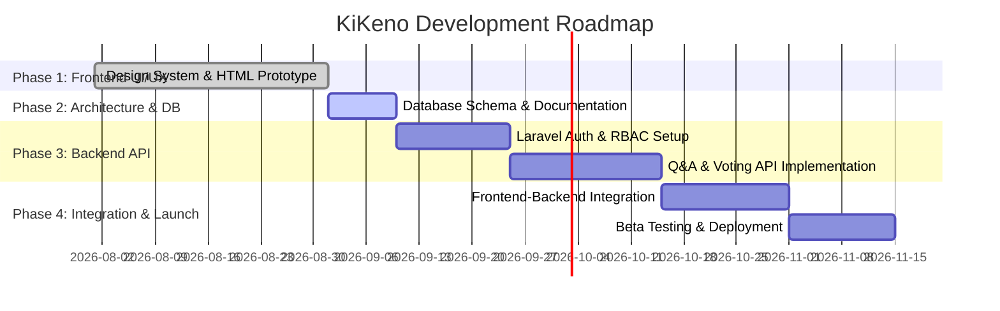

# KiKeno — Project Planning & Architecture

> **Project Name**: KiKeno (Forum & Knowledge Ecosystem)  
> **Summary**: KiKeno is a universal community Q&A forum and knowledge-sharing platform where anyone can seek help, provide expert answers, compare products and tech solutions, and follow self-paced learning roadmaps.

---

## 🎯 1. Project Vision & Objectives

### Vision
To create a trusted, high-quality, and community-driven knowledge ecosystem where information is clear, accessible, and structured for users ranging from curious beginners to subject-matter experts.

### Objectives
1. **Q&A Forum Platform**: Community-driven discussions with upvoting, downvoting, and accepted answer mechanisms.
2. **Deep-Dive Explanations**: Accessible breakdowns of complex topics in technology, finance, health, and career development.
3. **Comparison Matrix Engine**: Structured head-to-head feature comparisons (e.g., SSD vs HDD, FDR vs DPS, frameworks, devices).
4. **Interactive Learning Pathways**: Self-paced learning roadmaps, curated guides, downloadable cheatsheets, and progress tracking.

---

## 👥 2. User Roles & Access Control Hierarchy

| Role | Description | Key Permissions & Responsibilities |
|---|---|---|
| **Guest** | Unregistered visitor | Browse questions, search content, view comparisons, and read free learning guides. |
| **User** | Registered community member | Post new questions, write answers, vote (upvote/downvote), comment, and bookmark guides. |
| **Expert / Contributor** | Verified domain specialist | Provide certified expert answers, earn badges, and author study notes. |
| **Moderator** | Community safety manager | Flag/remove spam, re-categorize posts, edit tags, and manage reported content. |
| **Administrator** | System supervisor | Full platform administration, system configuration (`options` table), user role management, and analytics. |

---

## 🧱 3. Platform Core Modules

```
                     ┌─────────────────────────────────────────┐
                     │          KiKeno Ecosystem Engine         │
                     └────────────────────┬────────────────────┘
                                          │
       ┌──────────────────┬───────────────┴───────────────┬──────────────────┐
       │                  │                               │                  │
┌──────▼──────┐    ┌──────▼──────┐                 ┌──────▼──────┐    ┌──────▼──────┐
│  Q&A Feed   │    │ Knowledge   │                 │ Comparison  │    │  Learning   │
│  & Forum    │    │ Explanations│                 │   Matrix    │    │ Pathways    │
└─────────────┘    └─────────────┘                 └─────────────┘    └─────────────┘
```

### 3.1 Q&A Forum Module
- **Question Creation**: Rich title, category selection, tagging, markdown text formatting, and media attachments.
- **Answer Threading**: Threaded discussions, multiple response handling, and "Accepted Answer" highlighting by the question author.
- **Voting Mechanism**: Real-time upvoting and downvoting affecting content scores and user karma points.
- **Category Taxonomy**: Technology, Finance & Economy, Health, Education & Career, Mobile & Gadgets, Automobiles, etc.

### 3.2 Knowledge & Comparison Engine
- **Structured Comparisons**: Side-by-side spec comparison cards (e.g., SSD vs HDD, FDR vs DPS).
- **In-Depth Knowledge Articles**: High-level article formatting for deep queries such as "Why are iPhones expensive?" or "What is Laravel?".

### 3.3 Learning Pathways Module
- **Guides & Roadmaps**: Chapter-by-chapter tutorials with estimated reading times.
- **Cheatsheets & Study Notes**: Downloadable PDFs and copyable text cheatsheets.
- **Progress Tracking**: Logged-in user progress tracking across chapters and guides.

---

## 🛣️ 4. Development Roadmap & Milestones



### Phase 1: Frontend Prototype (Completed)
- Designed responsive layout in `index.html` featuring dark/light modes, hero masthead, category feeds, comparison matrix, and learning roadmap previews.

### Phase 2: Database Modeling & Architecture (Active)
- Formulated full relational schema, ER diagrams, foreign key constraints, and SQL migration scripts in `DATABASE_PLANNING.md`.

### Phase 3: Backend API Development (Planned)
- Build RESTful APIs using Laravel / Node.js with secure authentication (Sanctum/JWT).
- Implement Role-Based Access Control (RBAC) and request validation.

### Phase 4: Frontend Integration & Deployment (Planned)
- Connect dynamic API endpoints to the frontend prototype for real-time posting, voting, and progress tracking.

---

## 🛡️ 5. Non-Functional Requirements

1. **Performance**: Page load times under 2 seconds; optimized database queries with appropriate indexing strategies.
2. **Security**: Password hashing using Bcrypt/Argon2; prevention of SQL Injection, XSS, and CSRF attacks.
3. **SEO & Internationalization**: Semantic HTML markup, structured metadata, full Unicode support (`utf8mb4`).
