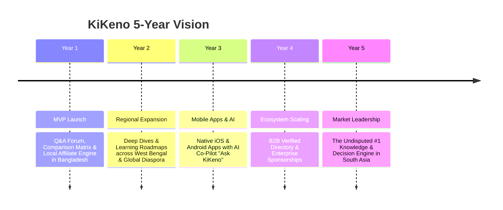

# KiKeno — Project Vision & Strategic Blueprint

> **"Ask, Discover, Understand & Learn"**  
> *Transforming how 300 Million+ people ask questions, compare choices, and master new skills.*

---

## 🌟 1. Executive Vision Statement

**KiKeno** (*kikeno.com*) is envisioned as the ultimate **Knowledge & Decision Engine**. Derived from the Bengali phrase **"কী কেন"** (*What & Why*) and phonetically evoking **"কী কেনা উচিত?"** (*What to buy?*), KiKeno bridges the gap between top-of-funnel curiosity, commercial decision-making, and structured learning.

Our goal is to build a trusted, modern, category-defining digital ecosystem where anyone can:
1. **Discover** answers to everyday and complex questions (**What**).
2. **Understand** the core logic, tech, and reasoning behind topics (**Why**).
3. **Compare** products, services, and financial options side-by-side (**What to Buy**).
4. **Learn** high-value skills using interactive roadmaps and cheatsheets (**How**).

---

## 💥 2. The Problem Statement & Market Opportunity

### The Problem
1. **Information Fragmentation**: Users currently have to hop between multiple outdated websites—a forum for Q&A, a blog for reviews, and shopping sites for specs.
2. **Lack of Structured Comparison Tools**: Consumers in Bangladesh and regional markets struggle to compare products, gadgets, software frameworks, or bank deposit schemes side-by-side in clear Bengali/English formats.
3. **Outdated User Experience**: Legacy forums in South Asia suffer from poor mobile responsiveness, cluttered ad layouts, and lack of visual polish.
4. **Unverified Information**: Online answers often lack credibility and expert verification.

### The Opportunity
- **300 Million+ Bengali Speakers** worldwide (Bangladesh, West Bengal, GCC, UK, US).
- A **$6 Billion+ E-commerce Market** in Bangladesh with over 35% of consumers actively researching and comparing products online before buying.
- High demand for structured, self-paced career roadmaps in tech, freelancing, and personal finance.

---

## 🏛️ 3. The 4-Pillar Product Ecosystem

```
                              ┌───────────────────────────────────┐
                              │            KiKeno.com             │
                              │     Knowledge & Decision Hub      │
                              └─────────────────┬─────────────────┘
                                                │
         ┌──────────────────┬───────────────────┴───────────────────┬──────────────────┐
         │                  │                                       │                  │
 ┌───────▼──────┐   ┌───────▼──────┐                        ┌───────▼──────┐   ┌───────▼──────┐
 │ 1. DISCOVER  │   │ 2. UNDERSTAND│                        │  3. COMPARE  │   │   4. LEARN   │
 │   (কী / What) │   │ (কেন / Why)  │                        │ (তুলনা / Buy) │   │  (শিখুন / How)│
 └──────────────┘   └──────────────┘                        └──────────────┘   └──────────────┘
   Q&A Forum &        Deep Dives &                           Product & Spec      Interactive
 Community Feed      Explanations                            Matrix Engine        Roadmaps
```

### Pillar 1: Discover (কী / What — Community Q&A)
- Community-driven question posting and answer submission.
- Real-time upvoting/downvoting, reputation points, and "Accepted Answer" verification.
- **AI "Ask-KiKeno" Assistant**: Instant 3-part summary cards (What, Why, Action Recommendation) generated at the top of search.

### Pillar 2: Understand (কেন / Why — Explanatory Deep Dives)
- In-depth, easy-to-understand analytical articles answering fundamental *why* questions (e.g., *"Why are iPhones expensive?"*, *"Why switch from HDD to SSD?"*).
- 3-bullet summary callouts for rapid skimmers.

### Pillar 3: Compare (তুলনা করুন / What to Buy — Decision Engine)
- Side-by-side spec comparison matrices for gadgets, tech stack frameworks, bank deposit schemes (FDR vs DPS), and lifestyle options.
- Dynamic "Best Overall", "Best Budget", and "Best Professional" recommendation cards.
- Integrated merchant buy buttons linked to local and international affiliate partners.

### Pillar 4: Learn (শিখুন / How — Self-Paced Roadmaps)
- Interactive learning pathways for web development, software architecture, career skills, and personal finance.
- Chapter checklists and user progress tracking.
- Master downloadable PDF cheatsheets for quick exam and interview reference.

---

## 👥 4. User Personas

| Persona | Motivation | How KiKeno Serves Them |
|---|---|---|
| **The Smart Shopper** | Wants to find the best laptop, phone, or bank scheme under budget. | Uses **Compare Matrices** to review side-by-side specs and click direct affiliate buy links. |
| **The Curious Learner** | Seeking clear answers to technical, financial, or daily life queries. | Posts questions on **Discover (Q&A)** and reads **Understand (Why)** deep dives. |
| **The Career Building Student** | Wants to learn coding, freelancing, or professional skills for free. | Follows **Learn Roadmaps**, completes chapters, and downloads cheatsheets. |
| **The Verified Expert / Business** | Wants to showcase domain expertise and generate client leads. | Earns a **Verified Expert Badge**, answers questions, and lists professional services. |

---

## 💰 5. Revenue & Monetization Vision

KiKeno is designed with a **diversified 6-tier revenue engine**:

1. **Affiliate Marketing (Highest ROI)**: Commission from local tech retailers (Star Tech, TechDeal, MA Computer) and marketplaces (Daraz, Amazon, Hostinger).
2. **Sponsored Comparisons & Reviews**: Featured placements paid by tech brands, financial firms, and software platforms.
3. **Programmatic Ads (AdSense / Ezoic)**: Non-intrusive CPM ads on high-volume Q&A pages.
4. **Verified Expert Subscriptions**: Monthly membership fees ($10–$30/mo) paid by local agencies, institutes, and consultants for lead generation buttons.
5. **Lead Generation Fees**: Commissions paid by banks for credit card/deposit leads and IT institutes for student leads.
6. **Premium Guides & Cheatsheets**: Micro-transactions for downloadable master bundles.

---

## 🎨 6. Design & Technical Philosophy

- **Visual Excellence**: Built on a modern design system ([`index.html`](file:///home/saroven/projects/kikeno.com/index.html)) featuring custom typography, dark/light mode, CSS variables, and high-performance layouts.
- **Mobile-First & Ultra-Fast**: Optimized for mobile devices (over 85% of traffic in target markets originates from smartphones).
- **SEO & Full-Text Search**: Semantic HTML5 structure, structured metadata, and full Unicode (`utf8mb4`) database support ([`DATABASE_PLANNING.md`](file:///home/saroven/projects/kikeno.com/DATABASE_PLANNING.md)).

---

## 🚀 7. Long-Term Growth Roadmap (5-Year Vision)



---

## 🔗 Related Documentation

- 📋 [**Project Planning (PROJECT_PLANNING.md)**](PROJECT_PLANNING.md) — Technical architecture, module specifications, user roles, and development milestones.
- 🗄️ [**Database Planning (DATABASE_PLANNING.md)**](DATABASE_PLANNING.md) — ER diagrams, relational table schemas, indexes, and ready-to-run DDL SQL migration scripts.
- 📖 [**Main Documentation (README.md)**](README.md) — Overview, stack details, and repository getting started guide.
